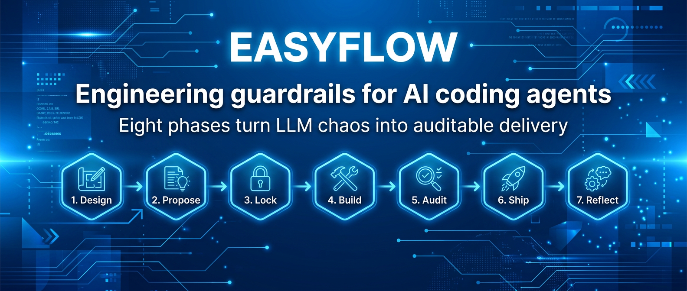
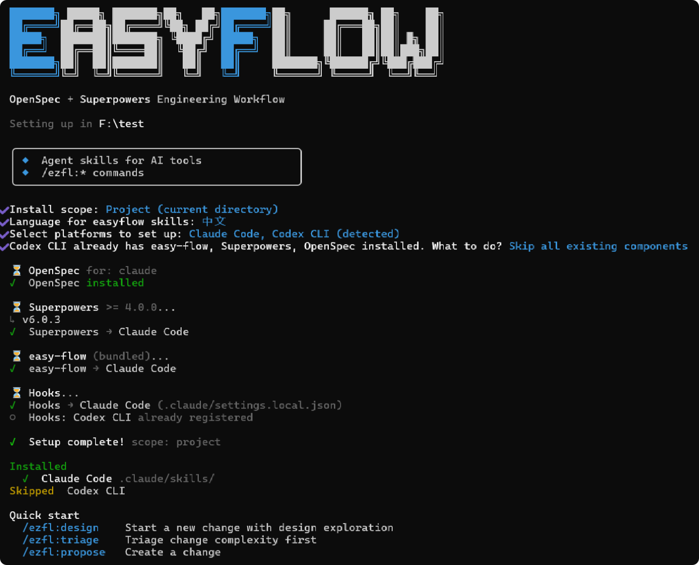
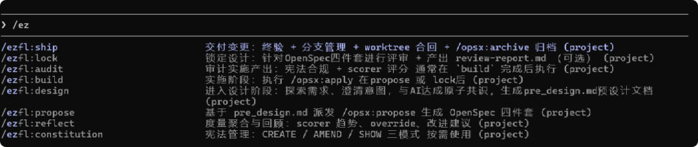

<p align="center">
  
</p>

<p align="center">

[](https://github.com/Mikey0212/easyflow/actions/workflows/ci.yml)
[](https://www.npmjs.com/package/@code-happy/easyflow)
[](https://www.npmjs.com/package/@code-happy/easyflow)
[](./LICENSE)

</p>

> 中文版：[README-zh.md](README-zh.md)

OpenSpec handles **WHAT** (proposal, design, spec lifecycle, archive).

Superpowers handles **HOW** (brainstorming, TDD, subagent-driven development, code review).

easyflow layers **orchestration + metrics + governance** on top, providing an seven-phase state machine: design → propose → lock → build → audit → ship → reflect.

## Why easyflow

- **OpenSpec has proposals, but lacks engineering guardrails** — there are no enforced constraints on code quality, test coverage, or architecture review between proposal and ship.
- **Superpowers has methodology, but lacks end-to-end orchestration** — brainstorming, TDD, and code review are independent; no state machine threads them into a pipeline.
- **easyflow fills the missing middle layer** — with the Constitution as the governance framework, scorer scripts as the metrics engine, and `.harness/` as runtime state, it orchestrates OpenSpec and Superpowers into an auditable, recoverable, and measurable engineering flow.

## Installation

Prerequisites:

- Node.js 20+
- npm/npx
- Git
- A bash-compatible shell environment (Windows users should use Git Bash)

```bash
npm install -g @code-happy/easyflow
```

## Quick Start

```bash
cd your-project
easyflow init
```

`easyflow init` will:



1. Prompt you to select AI platforms (auto-detects existing configuration)
2. Choose install scope: project (current directory) or global (home directory)
3. **Choose skill language: English or 中文** (Chinese)
4. Install [OpenSpec](https://github.com/Fission-AI/OpenSpec) CLI (via npm)
5. Install [Superpowers](https://github.com/obra/superpowers) skills (fetched from GitHub)
6. Install easy-flow skills (bundled, no network required) and deploy to selected platforms
7. Generate platform-specific command files (auto-adapts to 15 AI coding platforms)

> [!TIP]
> Update to the latest version:
>
> Run `easyflow update` or `npm install -g @code-happy/easyflow@latest`

## CLI Commands

<details>
<summary><code>easyflow init [path]</code> — Initialize workflow</summary>

Installs OpenSpec, Superpowers, and easy-flow skills for selected AI coding platforms.

| Option | Description |
|------|------|
| `--yes` | Non-interactive mode, auto-select detected platforms |
| `--scope <scope>` | Install scope: `project` or `global` |
| `--overwrite` | Overwrite installed components |
| `--skip-existing` | Skip already installed components |
| `--lang <lang>` | Skill language: `zh` or `en` |
| `--json` | Output structured JSON |

</details>

<details>
<summary><code>easyflow update [path]</code> — Update skills to latest versions</summary>

Checks the latest tags of upstream repos and diffs local skill files.

| Option | Description |
|------|------|
| `--force` | Force re-fetch all components |
| `--lang <lang>` | Language: `zh` or `en` (auto-detected if not specified) |

</details>

<details>
<summary><code>easyflow doctor [path]</code> — Diagnose installation health</summary>

Checks bash, git, node, openspec CLI, skills-lock.json and other dependencies.

| Option | Description |
|------|------|
| `--json` | Output structured diagnostics |

</details>

<details>
<summary><code>easyflow status [path]</code> — Show active changes (multi-worktree aware)</summary>

Reads the active change list from `.harness/workflow.yaml`, supports execution from any worktree.

| Option | Description |
|------|------|
| `--json` | Output JSON format |

</details>

| Command | Description |
|------|------|
| `easyflow --help` | Show help |
| `easyflow --version` | Show version |

## Supported Platforms

`easyflow init` supports 15 AI coding platforms:

| Platform | Skills Directory | Platform | Skills Directory |
|------|---------|------|---------|
| Claude Code | `.claude/` | CodeBuddy | `.codebuddy/` |
| Cursor | `.cursor/` | Codex CLI | `.codex/` |
| Gemini CLI | `.gemini/` | Windsurf | `.windsurf/` |
| Cline | `.cline/` | RooCode | `.roo/` |
| GitHub Copilot | `.github/` | Trae | `.trae/` |
| Lingma | `.lingma/` | Amazon Q | `.amazonq/` |
| Augment CLI | `.augment/` | Kiro | `.kiro/` |
| OpenCode | `.opencode/` | | |

## Eight-Phase Workflow



```
/ezfl:design → /ezfl:propose → /ezfl:lock → /ezfl:build → /ezfl:audit → /ezfl:ship → /ezfl:reflect
       (explore)        (four-piece)     (review)     (implement)    (audit)       (deliver)     (retrospect)
```

| Phase | Command | Output |
|------|------|--------|
| Design | `/ezfl:design` | `pre_design.md` (design after mandatory structured discussion) |
| Propose | `/ezfl:propose` | OpenSpec four-piece (proposal/design/specs/tasks) |
| Lock | `/ezfl:lock` | `review-report.md` (engineering review + cross-model review) |
| Build | `/ezfl:build` | Code implementation (by subagent running `/opsx:apply`) |
| Audit | `/ezfl:audit` | Constitution compliance audit + 5 scorer evaluations |
| Ship | `/ezfl:ship` | Final verification + rebase merge + worktree cleanup + archive |
| Reflect | `/ezfl:reflect` | Metrics trends, override analysis, improvement suggestions |

### Additional Commands

| Command | Description |
|------|------|
| `/ezfl:constitution` | Constitution management (CREATE / AMEND / SHOW) |

## Project Structure (After Install)

```
your-project/
├── .claude/skills/              # Platform skills directory (per platform chosen in init)
│   ├── easy-flow/               # easy-flow main directory
│   │   ├── skills/              # Phase skills (with policies/references)
│   │   ├── scripts/             # Hook + scorer scripts
│   │   ├── templates/           # Template files
│   │   └── commands/            # Slash command definitions
│   ├── brainstorming/           # Superpowers skills
│   ├── test-driven-development/
│   └── ...
├── .harness/                    # easy-flow runtime state
│   ├── workflow.yaml            # Active change cursor
│   ├── changes/<change_id>/     # Per-change business archive
│   └── .cache/                  # session_id, plugin_root
├── openspec/                    # OpenSpec artifacts
│   └── changes/<name>/
│       ├── proposal.md
│       ├── design.md
│       ├── specs/
│       └── tasks.md
└── eflow-lock.json              # Version lock file
```

## Core Features

- **Constitution Governance** — Project-level engineering principles, four injection points (A/B/C/D) auto-checking compliance at each phase
- **Deterministic Hook Scripts** — `draft-create.sh`, `worktree-create.sh`, `harness-sync.sh`, etc., downgrading critical operations from LLM "guessing" to real bash execution
- **Multi-Worktree Concurrency** — Each change develops in an isolated worktree, main repo keeps `.snapshot/` read-only backup
- **Cross-Model Review (Outside Voice)** — Lock phase auto-dispatches an independent subagent for second-round review
- **Template Forced Loading** — All markdown-generation phases must `read_file` templates before outputting, eliminating LLM memory-based fabrication
- **Rebase Merge** — Ship phase uses `git rebase + ff-only`, maintaining linear history
- **Full Platform Command Adaptation** — Auto-generates correct command files for 15 AI coding platforms (Codex global prompts, Windsurf workflows, Cursor flat commands, etc.)

## Version Constraints

| Component | Min Version | Source |
|------|---------|------|
| easy-flow | bundled | npm package (built-in) |
| superpowers | ≥ 4.0.0 | GitHub (git tag) |
| openspec | ≥ 1.4.0 | npm (@fission-ai/openspec) |

## Acknowledgments

easyflow stands on the shoulders of these excellent projects and their authors:

- **[OpenSpec](https://github.com/Fission-AI/OpenSpec)** — [Fission AI](https://github.com/Fission-AI) — The specification lifecycle framework that handles proposal, design, and archive workflows
- **[Superpowers](https://github.com/obra/superpowers)** — [Jesse Vincent (@obra)](https://github.com/obra) — The methodology skills (brainstorming, TDD, subagent-driven development, code review) that power the HOW
- **[Comet](https://github.com/rpamis/comet)** — Inspiration and reference for npm CLI design
- **[gstack](https://github.com/aspect-build/rules_lint)** — Inspiration for documentation review functionality

Thank you to all contributors and the open-source community for making this possible.
